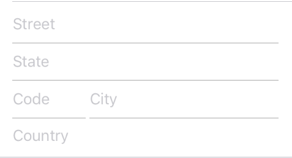

<p align="center">
<a href="https://travis-ci.org/xmartlabs/Eureka"></a>

<a href="https://developer.apple.com/swift"></a>
<a href="https://github.com/Carthage/Carthage"></a>
<a href="https://cocoapods.org/pods/Eureka"></a>
<a href="https://raw.githubusercontent.com/xmartlabs/Eureka/master/LICENSE"></a>
<a href="https://codebeat.co/projects/github-com-xmartlabs-eureka"></a>
</p>

Made with ❤️ by [XMARTLABS](http://xmartlabs.com). This is the re-creation of [XLForm] in Swift 2.

## Overview


## Contents

* [Requirements]
* [Usage]
  + [How to create a Form]
  + [Operators]
  + [Using the callbacks]
  + [Section Header and Footer]
  + [Dynamically hide and show rows (or sections)]
  + [List sections]
* [Custom rows]
  + [Basic custom rows]
  + [Custom inline rows]
  + [Custom presenter rows]
* [Row catalog]
* [Installation]
* [FAQ]

**For more information look at [our blog post] that introduces *Eureka*.**

## Requirements

* iOS 8.0+
* Xcode 7.3.1+

### Example project

You can clone and run the Example project to see examples of most of Eureka's features.


## Usage

### How to create a form
By extending `FormViewController` you can then simply add sections and rows to the `form` variable.

```swift
import Eureka

class MyFormViewController: FormViewController {

    override func viewDidLoad() {
        super.viewDidLoad()
        form +++ Section("Section1")
            <<< TextRow(){ row in
                row.title = "Text Row"
                row.placeholder = "Enter text here"
            }
            <<< PhoneRow(){
                $0.title = "Phone Row"
                $0.placeholder = "And numbers here"
            }
        +++ Section("Section2")
            <<< DateRow(){
                $0.title = "Date Row"
                $0.value = NSDate(timeIntervalSinceReferenceDate: 0)
            }
    }
}
```

In the example we create two sections with standard rows, the result is this:

<center>

</center>

You could create a form by just setting up the `form` property by yourself without extending from `FormViewController` but this method is typically more convenient.

### Getting row values

The `Row` object holds a  ***value*** of a specific type.
For example, a `SwitchRow` holds a `Bool` value, while a `TextRow` holds a `String` value.

```swift
// Get the value of a single row
let row: TextRow? = form.rowByTag("MyRowTag")
let value = row.value

// Get the value of all rows which have a Tag assigned
// The dictionary contains the 'rowTag':value pairs.
let valuesDictionary = form.values()
```

### Operators

Eureka includes custom operators to make form creation easy:

#### +++ &nbsp;&nbsp;&nbsp;&nbsp;&nbsp;&nbsp;Add a section
```swift
form +++ Section()

// Chain it to add multiple Sections
form +++ Section("First Section") +++ Section("Another Section")

// Or use it with rows and get a blank section for free
form +++ TextRow()
     +++ TextRow()  // Each row will be on a separate section
```

#### <<< &nbsp;&nbsp;&nbsp;&nbsp;&nbsp;&nbsp;Insert a row

```swift
form +++ Section()
        <<< TextRow()
        <<< DateRow()

// Or implicitly create the Section
form +++ TextRow()
        <<< DateRow()
```

#### += &nbsp;&nbsp;&nbsp;&nbsp;&nbsp;&nbsp; Append an array

```swift
// Append Sections into a Form
form += [Section("A"), Section("B"), Section("C")]

// Append Rows into a Section
section += [TextRow(), DateRow()]
```

### Using the callbacks

Eureka includes callbacks to change the appearance and behavior of a row.

#### Understanding Row and Cell

A `Row` is an abstraction Eureka uses which holds a **value** and contains the view `Cell`. The `Cell` manages the view and subclasses `UITableViewCell`.

Here is an example:

```swift
let row  = SwitchRow("SwitchRow") { row in      // initializer
                        row.title = "The title"
                    }.onChange { row in
                        row.title = (row.value ?? false) ? "The title expands when on" : "The title"
                        row.updateCell()
                    }.cellSetup { cell, row in
                        cell.backgroundColor = .lightGrayColor()
                    }.cellUpdate { cell, row in
                        cell.textLabel?.font = .italicSystemFontOfSize(18.0)
                }
```


#### Callbacks list

* **onChange()**

	Called when the value of a row changes. You might be interested in adjusting some parameters here or even make some other rows appear or disappear.
* **onCellSelection()**

	Called each time the user taps on the row and it gets selected.
* **cellSetup()**

	Called only once when the cell is first configured. Set permanent settings here.
* **cellUpdate()**

	Called each time the cell appears on screen. You can change the appearance here using variables that may not be present on cellSetup().
* **onCellHighlight()**

  Called whenever the cell or any subview become the first responder.

* **onCellUnHighlight()**

  Called whenever the cell or any subview resigns the first responder.

* **onExpandInlineRow()**

  Called before expanding the inline row. Applies to rows conforming `InlineRowType` protocol.

* **onCollapseInlineRow()**

  Called before collapsing the inline row. Applies to rows conforming `InlineRowType` protocol.

* **onPresent()**

	Called by a row just before presenting another view controller. Applies to rows conforming `PresenterRowType` protocol. Use it to set up the presented controller.


### Section Header and Footer

You can set a title `String` or a custom `View` as the header or footer of a `Section`.

#### String title
```swift
Section("Title")

Section(header: "Title", footer: "Footer Title")

Section(footer: "Footer Title")
```

#### Custom view
You can use a Custom View from a `.xib` file:

```swift
Section() { section in
    var header = HeaderFooterView<MyHeaderNibFile>(.NibFile(name: "MyHeaderNibFile", bundle: nil))

    // Will be called every time the header appears on screen
    header.onSetupView = { view, _ in
        // Commonly used to setup texts inside the view
        // Don't change the view hierarchy or size here!
    }
    section.header = header
}
```

Or a custom `UIView` created programmatically

```swift
Section(){ section in
    var header = HeaderFooterView<MyCustomUIView>(.Class)
    header.height = {100}
    header.onSetupView = { view, _ in
        view.backgroundColor = .redColor()
    }
    section.header = header
}
```
Or just build the view with a Callback
```swift
Section(){ section in
    section.header = {
          var header = HeaderFooterView<UIView>(.Callback({
              let view = UIView(frame: CGRect(x: 0, y: 0, width: 100, height: 100))
              view.backgroundColor = .redColor()
              return view
          }))
          header.height = { 100 }
          return header
        }()
}
```

### Dynamically hide and show rows (or sections)  <a name="hide-show-rows"></a>


In this case we are hiding and showing whole sections.

To accomplish this each row has an `hidden` variable of optional type `Condition` which can be set using a function or `NSPredicate`.


#### Hiding using a function condition

Using the `Function` case of `Condition`:
```swift
Condition.Function([String], (Form?)->Bool)
```
The array of `String` to pass should contain the tags of the rows this row depends on. Each time the value of any of those rows changes the function is reevaluated.
The function then takes the `Form` and returns a `Bool` indicating whether the row should be hidden or not. This the most powerful way of setting up the `hidden` property as it has no explicit limitations of what can be done.

```swift
form +++ Section()
            <<< SwitchRow("switchRowTag"){
                $0.title = "Show message"
            }
            <<< LabelRow(){

                $0.hidden = Condition.Function(["switchRowTag"], { form in
                    return !((form.rowByTag("switchRowTag") as? SwitchRow)?.value ?? false)
                })
                $0.title = "Switch is on!"
        }
```


```swift
public enum Condition {
    case Function([String], (Form?)->Bool)
    case Predicate(NSPredicate)
}
```

  #### Hidding using an NSPredicate

The `hidden` variable can also be set with a NSPredicate. In the predicate string you can reference values of other rows by their tags to determine if a row should be hidden or visible.
This will only work if the values of the rows the predicate has to check are NSObjects (String and Int will work as they are bridged to their ObjC counterparts, but enums won't work).
Why could it then be useful to use predicates when they are more limited? Well, they can be much simpler, shorter and readable than functions. Look at this example:

```swift
$0.hidden = Condition.Predicate(NSPredicate(format: "$switchTag == false"))
```

And we can write it even shorter since `Condition` conforms to `StringLiteralConvertible`:

```swift
$0.hidden = "$switchTag == false"
```

*Note: we will substitute the value of the row whose tag is 'switchTag' instead of '$switchTag'*

For all of this to work, **all of the implicated rows must have a tag** as the tag will identify them.

We can also hide a row by doing:
```swift
$0.hidden = true
```
as `Condition` conforms to `BooleanLiteralConvertible`.

Not setting the `hidden` variable will leave the row always visible.

##### Sections
For sections this works just the same. That means we can set up section `hidden` property to show/hide it dynamically.

##### Disabling rows
To disable rows, each row has an `disabled` variable which is also an optional `Condition` type property. This variable also works the same as the `hidden` variable so that it requires the rows to have a tag.

Note that if you want to disable a row permanently you can also set `disabled` variable to `true`.

### List Sections

To display a list of options, Eureka includes a special section called `SelectableSection`.
When creating one you need to pass the type of row to use in the options and the `selectionStyle`. The `selectionStyle` is an enum which can be either `MultipleSelection` or `SingleSelection(enableDeselection: Bool)` where the `enableDeselection` parameter determines if the selected rows can be deselected or not.

```swift
form +++ SelectableSection<ListCheckRow<String>, String>("Where do you live", selectionType: .SingleSelection(enableDeselection: true))

let continents = ["Africa", "Antarctica", "Asia", "Australia", "Europe", "North America", "South America"]
for option in continents {
    form.last! <<< ListCheckRow<String>(option){ listRow in
        listRow.title = option
        listRow.selectableValue = option
        listRow.value = nil
    }
}
```

##### What kind of rows can be used?

To create such a section you have to create a row that conforms the `SelectableRowType` protocol.

```swift
public protocol SelectableRowType : RowType {
    var selectableValue : Value? { get set }
}
```

This `selectableValue` is where the value of the row will be permanently stored. The `value` variable will be used to determine if the row is selected or not, being 'selectableValue' if selected or nil otherwise.
Eureka includes the `ListCheckRow` which is used for example. In the custom rows of the Examples project you can also find the `ImageCheckRow`.

##### Getting the selected rows

To easily get the selected row/s of a `SelectableSection` there are two methods: `selectedRow()` and `selectedRows()` which can be called to get the selected row in case it is a `SingleSelection` section or all the selected rows if it is a `MultipleSelection` section.


## Custom rows

### Basic custom rows

To create a row with custom behavior and appearance you'll probably want to create subclasses of `Row` and `Cell`.

Remember that `Row` is the abstraction Eureka uses, while the `Cell` is the actual `UITableViewCell` in charge of the view.
As the `Row` contains the `Cell`, both `Row` and `Cell` must be defined for the same **value** type.

```swift
// Custom Cell with value type: Bool
// The cell is defined using a .xib, so we can set outlets :)
public class CustomCell: Cell<Bool>, CellType{
    @IBOutlet weak var switchControl: UISwitch!
    @IBOutlet weak var label: UILabel!

    public override func setup() {
        super.setup()
        switchControl.addTarget(self, action: #selector(CustomCell.switchValueChanged), forControlEvents: .ValueChanged)
    }

    func switchValueChanged(){
        row.value = switchControl.on
        row.updateCell() // Re-draws the cell which calls 'update' bellow
    }

    public override func update() {
        super.update()
        backgroundColor = (row.value ?? false) ? .whiteColor() : .blackColor()
    }
}

// The custom Row also has value: Bool, and cell: CustomCell
public final class CustomRow: Row<Bool, CustomCell>, RowType {
    required public init(tag: String?) {
        super.init(tag: tag)
        // We set the cellProvider to load the .xib corresponding to our cell
        cellProvider = CellProvider<CustomCell>(nibName: "CustomCell")
    }
}
```
The result: <br>


<br>
Custom rows need to subclass `Row<ValueType, CellType>` and conform to `RowType` protocol.
Custom cells need to subclass `Cell<ValueType>` and conform to `CellType` protocol.

Just like the callbacks cellSetup and CellUpdate, the `Cell` has the setup and update methods where you can customize it.


### Custom inline rows

A inline row is a specific type of row that shows dynamically a row below it, normally an inline row changes between a expand and collapse mode whenever the row is tapped.

So to create a inline row we need 2 rows, the row that are "always" visible and the row that will expand/collapse.

Another requirement is that the value type of these 2 rows must be the same.

Once we have these 2 rows, we should make the top row type conforms to `InlineRowType` which will add some methods to the top row class type such as:

```swift
func expandInlineRow()
func hideInlineRow()
func toggleInlineRow()
```

Finally we must invoke `toggleInlineRow()` when the row is selected, for example overriding the customDidSelect() row method.

```swift
public override func customDidSelect() {
    toggleInlineRow()
}
```

### Custom Presenter rows

**Note:** *A Presenter row is a row that presents a new UIViewController.*

To create a custom Presenter row you must create a class that conforms the `PresenterRowType` protocol. It is highly recommended to subclass `SelectorRow` as it does conform to that protocol and adds other useful functionality.

The PresenterRowType protocol is defined as followes:
```swift
public protocol PresenterRowType: TypedRowType {
    typealias ProviderType : UIViewController, TypedRowControllerType
    var presentationMode: PresentationMode<ProviderType>? { get set }
    var onPresentCallback: ((FormViewController, ProviderType)->())? { get set }
}
```

The onPresentCallback will be called when the row is about to present another view controller. This is done in the `SelectorRow` so if you do not sublass it you will have to call it yourself.

The `presentationMode` is what defines how the controller is presented and which controller is presented. This presentation can be using a Segue identifier, a segue class, presenting a controller modally or pushing to a specific view controller. For example a CustomPushRow can be defined like this:

```swift
public final class CustomPushRow<T: Equatable> : SelectorRow<T, SelectorViewController<T>>, RowType {

    public required init(tag: String?) {
        super.init(tag: tag)
        presentationMode = .Show(controllerProvider: ControllerProvider.Callback {
        	return SelectorViewController<T>(){ _ in }
        }, completionCallback: { vc in
        	vc.navigationController?.popViewControllerAnimated(true)
        })
    }
}
```

You can place your own UIViewController instead of SelectorViewController<T>.

## Row catalog

### Controls Rows
<table>
    <tr>
        <td><center><b>Label Row</b><br>
        
        </center><br><br>
        </td>

        <td><center><b>Button Row</b><br>
        
        </center><br><br>
        </td>

        <td><center><b>Check Row</b><br>
        
        </center><br><br>
        </td>
    </tr>
    <tr>
        <td><center><b>Switch Row</b><br>
        
        </center><br><br>
        </td>

        <td><center><b>Slider Row</b><br>
        
        </center><br><br>
        </td>

        <td><center><b>Stepper Row</b><br>
        
        </center><br><br>
        </td>        
    </tr>
    <tr>
        <td><center><b>Text Area Row</b><br>
        
        </center><br><br>
        </td>
        <td><center><b>Postal Address Row</b><br>
        
        </center><br><br>
        </td>
        <td><center><b>Picture Row</b><br>
        
        </center><br><br>
        </td>
    </tr>
</table>

### Field Rows
These rows have a textfield on the right side of the cell. The difference between each one of them consists in a different capitalization, autocorrection and keyboard type configuration.

<table>
<tr>
  <td>
    
  </td>
  <td>
  TextRow<br><br>
  NameRow<br><br>
  URLRow<br><br>
  IntRow<br><br>
  PhoneRow<br><br>
  PasswordRow<br><br>
  EmailRow<br><br>
  DecimalRow<br><br>
  TwitterRow<br><br>
  AccountRow<br><br>
  ZipCodeRow
  </td>
<tr>
</table>

Typically we want to show a field row value using a formatter, for instance a currency formatter. To do so the previous rows have a formatter property that can be used to set up any formatter. useFormatterDuringInput determines if the formatter also should be used during row editing, this means, when the row's textfield is the first responder. The main challenge of using the formatting when the row is being edited is keeping updated the cursor position accordingly. Eureka provides the following protocol that your formatter should conform to in order to handle cursor position.

For more information take a look at DecimalFormatter and CurrencyFormatter in the Example project.

```swift
public protocol FormatterProtocol {
    func getNewPosition(forPosition forPosition: UITextPosition, inTextInput textInput: UITextInput, oldValue: String?, newValue: String?) -> UITextPosition
}
```

### Date Rows

Date Rows hold a NSDate and allow us to set up a new value through UIDatePicker control. The mode of the UIDatePicker and the way how the date picker view is shown is what changes between them.
<table>
<tr>
<td>
<center><b>Date Row</b>

<br>
Picker shown in the keyboard.
</center>
</td>
<td>
<center><b>Date Row (Inline)</b>

<br>
The row expands.
</center>
</td>
<td>
<center><b>Date Row (Picker)</b>

<br>
The picker is always visible.
</center>
</td>
</tr>
</table>

With those 3 styles (Normal, Inline & Picker), Eureka includes:

+ **DateRow**
+ **TimeRow**
+ **DateTimeRow**
+ **CountDownRow**

### Option Rows
These are rows with a list of options associated from which the user must choose.

```swift
<<< ActionSheetRow<String>() {
                $0.title = "ActionSheetRow"
                $0.selectorTitle = "Pick a number"
                $0.options = ["One","Two","Three"]
                $0.value = "Two"    // initially selected
            }
```

<table>
<tr>
<td width="25%">
<center><b>Alert Row</b><br>

<br>
Will show an alert with the options to choose from.
</center>
</td>
<td width="25%">
<center><b>ActionSheet Row</b><br>

<br>
Will show an action sheet with the options to choose from.
</center>
</td>
<td width="25%">
<center><b>Push Row</b><br>

<br>
Will push to a new controller from where to choose options listed using Check rows.
</center>
</td>
<td width="25%">
<center><b>Multiple Selector Row</b><br>

<br>
Like PushRow but allows the selection of multiple options.
</center>
</td>
</tr>
</table>

<table>
    <tr>
        <td><center><b>Segmented Row</b><br>
        
        </center>
        </td>

        <td><center><b>Segmented Row (w/Title)</b><br>
        
        </center>
        </td>

        <td><center><b>Picker Row</b><br>
        
        <br>Presents options of a generic type through a picker view
        <br><b>(There is also Picker Inline Row)
        </center>
        </td>
    </tr>
</table>

### Built your own custom row?
Let us know about it, we would be glad to mention it here. :)

* **LocationRow** (Included as custom row in the example project)


## Installation

#### CocoaPods

[CocoaPods](https://cocoapods.org/) is a dependency manager for Cocoa projects.

Specify Eureka into your project's `Podfile`:

```ruby
source 'https://github.com/CocoaPods/Specs.git'
platform :ios, '8.0'
use_frameworks!

pod 'Eureka', '~> 1.6'
```

Then run the following command:

```bash
$ pod install
```

#### Carthage

[Carthage](https://github.com/Carthage/Carthage) is a simple, decentralized dependency manager for Cocoa.

Specify Eureka into your project's `Cartfile`:

```ogdl
github "xmartlabs/Eureka" ~> 1.6
```

#### Manually as Embedded Framework

* Clone Eureka as a git [submodule](http://git-scm.com/docs/git-submodule) by running the following command from your project root git folder.

```bash
$ git submodule add https://github.com/xmartlabs/Eureka.git
```

* Open Eureka folder that was created by the previous git submodule command and drag the Eureka.xcodeproj into the Project Navigator of your application's Xcode project.

* Select the Eureka.xcodeproj in the Project Navigator and verify the deployment target matches with your application deployment target.

* Select your project in the Xcode Navigation and then select your application target from the sidebar. Next select the "General" tab and click on the + button under the "Embedded Binaries" section.

* Select `Eureka.framework` and we are done!

## Getting involved

* If you **want to contribute** please feel free to **submit pull requests**.
* If you **have a feature request** please **open an issue**.
* If you **found a bug** check older issues before submitting an issue.
* If you **need help** or would like to **ask general question**, use [StackOverflow]. (Tag `eureka-forms`).

**Before contribute check the [CONTRIBUTING](CONTRIBUTING.md) file for more info.**

If you use **Eureka** in your app We would love to hear about it! Drop us a line on [twitter].

## Authors

* [Martin Barreto](https://github.com/mtnBarreto) ([@mtnBarreto](https://twitter.com/mtnBarreto))
* [Mathias Claassen](https://github.com/mats-claassen) ([@mClaassen26](https://twitter.com/mClaassen26))

## FAQ

#### How to get the value of a row?

The value of a row can be obtained with `row.value`. The type of this value is the type of the row (i.e. the value of a `PickerRow<String>` is of type `String`).

#### How to change the bottom navigation accessory view?

To change the behaviour of this you should set the navigation options of your controller. The `FormViewController` has a `navigationOptions` variable which is an enum and can have one or more of the following values:

- **Disabled**: no view at all
- **Enabled**: enable view at the bottom
- **StopDisabledRow**: if the navigation should stop when the next row is disabled
- **SkipCanNotBecomeFirstResponderRow**: if the navigation should skip the rows that return false to `canBecomeFirstResponder()`

The default value is `Enabled & SkipCanNotBecomeFirstResponderRow`

If you want to change the whole view of the bottom you will have to override the `navigationAccessoryView` variable in your subclass of `FormViewController`.

#### How to get a Row using its tag value

We can get a particular row by invoking any of the following functions exposed by the `Form` class:

```swift
public func rowByTag<T: Equatable>(tag: String) -> RowOf<T>?
public func rowByTag<Row: RowType>(tag: String) -> Row?
public func rowByTag(tag: String) -> BaseRow?
```

For instance:

```swift
let dateRow : DateRow? = form.rowByTag("dateRowTag")
let labelRow: LabelRow? = form.rowByTag("labelRowTag")

let dateRow2: Row<NSDate>? = form.rowByTag("dateRowTag")

let labelRow2: BaseRow? = form.rowByTag("labelRowTag")
```

#### How to get a Section using its tag value

```swift
let section: Section?  = form.sectionByTag("sectionTag")
```

#### How to set the form values using a dictionary

Invoking `setValues(values: [String: Any?])` which is exposed by `Form` class.

For example:

```swift
form.setValues(["IntRowTag": 8, "TextRowTag": "Hello world!", "PushRowTag": Company(name:"Xmartlabs")])
```

Where `"IntRowTag"`, `"TextRowTag"`, `"PushRowTag"` are row tags (each one uniquely identifies a row) and `8`, `"Hello world!"`, `Company(name:"Xmartlabs")` are the corresponding row value to assign.

The value type of a row must match with the value type of the corresponding dictionary value otherwise nil will be assigned.

If the form was already displayed we have to reload the visible rows either by reloading the table view `tableView.reloadData()` or invoking `updateCell()` to each visible row.

#### Row does not update after changing hidden or disabled condition

After setting a condition, this condition is not automatically evaluated. If you want it to do so immediately you can call `.evaluateHidden()` or `.evaluateDisabled()`.

This functions are just called when a row is added to the form and when a row it depends on changes. If the condition is changed when the row is being displayed then it must be reevaluated manually.

#### onCellUnHighlight doesn't get called unless onCellHighlight is also defined

Look at this [issue](https://github.com/xmartlabs/Eureka/issues/96).

#### How to update a Section header/footer

* Set up a new header/footer data ....

```swift
section.header = "Header Title" // use string literal as a header/footer data. HeaderFooterView conforms to StringLiteralConvertible.
//or
section.header = HeaderFooterView(title: "Header title \(variable)") // use String interpolation
//or
var header = HeaderFooterView<UIView>(.Class) // most flexible way to set up a header using any view type
header.height = { 60 }  // height can be calculated
header.onSetupView = { view, section in  // each time the view is about to be displayed onSetupView is invoked.
    view.backgroundColor = .orangeColor()
}
section.header = header
```

* Reload the Section to perform the changes

```swift
section.reload()
```

#### Don't want to use Eureka custom operators?

As we've said `Form` and `Section` types conform to `MutableCollectionType` and `RangeReplaceableCollectionType`. A Form is a collection of Sections and a Section is a collection of Rows.

`RangeReplaceableCollectionType` protocol extension provides many useful methods to modify collection.

```swift
extension RangeReplaceableCollectionType {
    public mutating func append(newElement: Self.Generator.Element)
    public mutating func appendContentsOf<S : SequenceType where S.Generator.Element == Generator.Element>(newElements: S)
    public mutating func insert(newElement: Self.Generator.Element, atIndex i: Self.Index)
    public mutating func insertContentsOf<C : CollectionType where C.Generator.Element == Generator.Element>(newElements: C, at i: Self.Index)
    public mutating func removeAtIndex(index: Self.Index) -> Self.Generator.Element
    public mutating func removeRange(subRange: Range<Self.Index>)
    public mutating func removeFirst(n: Int)
    public mutating func removeFirst() -> Self.Generator.Element
    public mutating func removeAll(keepCapacity keepCapacity: Bool = default)
    public mutating func reserveCapacity(n: Self.Index.Distance)
}
```

These methods are used internally to implement the custom operators as shown bellow:

```swift
public func +++(left: Form, right: Section) -> Form {
    left.append(right)
    return left
}

public func +=< C : CollectionType where C.Generator.Element == Section>(inout lhs: Form, rhs: C){
    lhs.appendContentsOf(rhs)
}

public func <<<(left: Section, right: BaseRow) -> Section {
    left.append(right)
    return left
}

public func +=< C : CollectionType where C.Generator.Element == BaseRow>(inout lhs: Section, rhs: C){
    lhs.appendContentsOf(rhs)
}
```

You can see how the rest of custom operators are implemented [here](https://github.com/xmartlabs/Eureka/blob/master/Source/Core/Operators.swift).

It's up to you to decide if you want to use Eureka custom operators or not.

<!--- In file -->
[Introduction]: #introduction
[Requirements]: #requirements

[How to create a Form]: #how-to-create-a-form
[How to get the form values]: #how-to-get-the-form-values
[Examples]: #examples
[Usage]: #usage
[Operators]: #operators
[Rows]: #rows
[Using the callbacks]: #using-the-callbacks
[Section Header and Footer]: #section-header-and-footer
[Custom rows]: #custom-rows
[Basic custom rows]: #basic-custom-rows
[Custom inline rows]: #custom-inline-rows
[Custom presenter rows]: #custom-presenter-rows
[How to create custom inline rows]: #how-to-create-custom-inline-rows
[Custom rows catalog]: #custom-rows-catalog
[Dynamically hide and show rows (or sections)]: #hide-show-rows
[Implementing a custom Presenter row]: #custom-presenter-row
[Extensibility]: #extensibility
[Row catalog]: #row-catalog
[Installation]: #installation
[FAQ]: #faq

[List sections]: #list-sections


* [Installation]
* [FAQ]


<!--- In Project -->
[CustomCellsController]: Example/Example/ViewController.swift
[FormViewController]: Example/Source/Controllers.swift

<!--- External -->
[XLForm]: http://github.com/xmartlabs/XLForm
[DSL]: https://en.wikipedia.org/wiki/Domain-specific_language
[StackOverflow]: http://stackoverflow.com/questions/tagged/eureka-forms
[our blog post]: http://blog.xmartlabs.com/2015/09/29/Introducing-Eureka-iOS-form-library-written-in-pure-Swift/
[twitter]: https://twitter.com/xmartlabs

# Change Log

This can be found in the [CHANGELOG.md](CHANGELOG.md) file.
