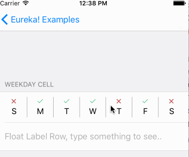
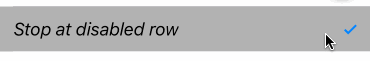

<p align="center">
<a href="https://travis-ci.org/xmartlabs/Eureka"></a>

<a href="https://developer.apple.com/swift"></a>
<a href="https://github.com/Carthage/Carthage"></a>
<a href="https://cocoapods.org/pods/Eureka"></a>
<a href="https://raw.githubusercontent.com/xmartlabs/Eureka/master/LICENSE"></a>
<a href="https://codebeat.co/projects/github-com-xmartlabs-eureka"></a>
</p>

**Eureka** is a dynamic tableView forms generation library written in Swift.
Made with ❤️  by [XMARTLABS](http://xmartlabs.com). This is the re-creation of [XLForm] in Swift 2.

## Complex forms made simple


* [Introduction]
* [Requirements]
* [Examples]
* [Usage]
  + [How to create a Form]
  + [How to get the form values]
  + [Operators]
  + [Rows]
  + [Customization]
  + [Section Header and Footer]
  + [How to dynamically hide and show rows (or sections)]
* [Extensibility]
  + [How to create custom rows and cells]
  + [How to create custom inline rows]
  + [Implementing a custom Presenter row]
  + [Custom rows catalog]
* [Installation]
* [FAQ]

**For more information look at [our blog post] that introduces *Eureka!*.**

## Requirements

* iOS 8.0+
* Xcode 7.3+

## Example Project

To run Example project:
1. Clone Eureka repository
2. Open Eureka workspace
3. Run the *Example* project.

You can also experiment and learn with the *Eureka Playground* which is contained in *Eureka.workspace*.

## Usage

### How to create a form
Creating a form is simple:

```swift
import Eureka

class MyFormViewController: FormViewController {

    override func viewDidLoad() {
        super.viewDidLoad()
        form +++ Section("Section1")
            <<< TextRow(){ row in
                row.title = "Text Row"
                row.placeholder = "Enter text here"
            }
            <<< PhoneRow(){
                $0.title = "Phone Row"
                $0.placeholder = "And numbers here"
            }
        +++ Section("Section2")
            <<< DateRow(){
                $0.title = "Date Row"
                $0.value = NSDate(timeIntervalSinceReferenceDate: 0)
            }
    }
}
```

By extending [FormViewController] you can then simply add sections and rows to the `form` variable.

In the example we create two sections with standard rows, the result is this:



You could create a form by just setting up the `form` property by yourself without extending from `FormViewController` but this method is typically more convenient.

### Getting row values

```swift
// Get the value of a single row
if let value = (form.rowByTag("MyRowTag") as? TextRow)?.value{
    // Do something
}

// Get the value of all rows which have a Tag assigned
// The dictionary contains the 'rowTag':value pairs.
let valuesDictionary = form.values()
```

### Operators

Eureka includes custom operators to facilitate form creation and modification.

#### +++
Adds a section to the form:

```swift
form +++ Section()

// Chain it to add multiple Sections
form +++ Section("First Section") +++ Section("Another Section")

// Or use it with rows and get a blank section for free
form +++ TextRow()
     +++ TextRow()  // Each row will be on a separate section
```

#### <<<
Append rows a Section:

```swift
form +++ Section()
        <<< TextRow()
        <<< DateRow()

// Or implicitly create the Section
form +++ TextRow()
        <<< DateRow()
```

#### +=
Append arrays of elements to either a Form or a Section like this:

```swift
// Append Sections into a Form
form += [Section("A"), Section("B"), Section("C")]

// Append Rows into a Section
section += [TextRow(), DateRow()]
```

###### To learn more about these operators try them out in Eureka Playground.

### Customization

#### Understanding Row and Cell
A `Row` is an abstract container which holds the model and the view **cell**. The `Cell` manages actual view and subclasses `UITableViewCell` accordingly.

#### The callbacks
There are many callbacks to change the default appearance and behavior of a row.

##### Example
```swift
form +++ TextRow("Tag")
                    .cellSetup({ (cell, row) in     // cell contains the view, row is the holder
                        cell.backgroundColor = .redColor()
                        cell.height = {100}         // Height is a computed property
                    })
                    .onCellSelection({ (cell, row) in
                        // Do something
                    })
```

* **onChange()**

	This will be called when the value of a row changes. You might be interested in adjusting some parameters here or even make some other rows appear or disappear.
* **onCellSelection()**

	This one will be called each time the user taps on the row and it gets selected.
* **cellSetup()**

	The cellSetup will be called once when the cell is first configured. Here you should set up your cell with its permanent settings.
* **cellUpdate()**

	The cellUpdate will be called each time the cell appears on screen. Here you can change how the title and value of your row is set or change the appearance (colors, fonts, etc) depending on variables that might not be present at cell creation time.

* **onCellHighlight()**

  The onCellHighlight will be invoked whenever the cell or any subview become the first responder.

* **onCellUnHighlight()**

  The onCellUnHighlight will be invoked whenever the cell or any subview resign the first responder.

* **onExpandInlineRow()**

  The onExpandInlineRow will be invoked before expand the inline row. This does only apply to the rows conforming to the `InlineRowType` protocol.

* **onCollapseInlineRow()**

  The onCollapseInlineRow will be invoked before collapse the inline row. This does only apply to the rows conforming to the `InlineRowType` protocol.

* **onPresent()**

	This method will be called by a row just before presenting another view controller. This does only apply to the rows conforming to the `PresenterRowType` protocol. You can use this to set up the presented controller.

Each row also has an initializer where you should set the basic attributes of the row.

Here is an example:

```swift
let row  = CheckRow("set_disabled") { // initializer
              $0.title = "Stop at disabled row"
              $0.value = self.navigationOptions?.contains(.StopDisabledRow)
           }.onChange { [weak self] row in
              if row.value ?? false {
                  self?.navigationOptions = self?.navigationOptions?.union(.StopDisabledRow)
              }
              else{
                  self?.navigationOptions = self?.navigationOptions?.subtract(.StopDisabledRow)
              }
           }.cellSetup { cell, row in
              cell.backgroundColor = .lightGrayColor()
           }.cellUpdate { cell, row in
              cell.textLabel?.font = .italicSystemFontOfSize(18.0)
           }
```

Now it would look like this:



### Section Header and Footer

You can set a title `String` or a custom `View` as the header or footer of a `Section`.

#### String title
```swift
Section("Title")

Section(header: "Title", footer: "Footer Title")

Section(footer: "Footer Title")
```

#### Custom view
You can use a Custom View from a .xib file:
```swift
Section() { section in
	var header = HeaderFooterView<MyHeaderNibFile>(.NibFile(name: "MyHeaderNibFile", bundle: nil))

  // Will be called every time the header appears on screen
  header.onSetupView = { view, _ in
       // Commonly used to setup texts inside the view
       // Don't change the view hierarchy or size here!
	 }

	section.header = header
}
```
Or a custom UIView created programmatically
```swift
form +++ Section(){ section in
            var header = HeaderFooterView<MyCustomUIView>(.Class)
            header.height = {100}
            header.onSetupView = { view, section in
                view.backgroundColor = .redColor()
            }
            section.header = header
        }
```
Or just build the view with a Callback
```swift
form +++ Section(){ section in
            section.header = {
                var header = HeaderFooterView<UIView>(.Callback({
                    let view = UIView(frame: CGRect(x: 0, y: 0, width: 100, height: 100))
                    view.backgroundColor = .redColor()
                    return view
                }))
                header.height = {100}
                return header
            }()
        }
```

### How to dynamically hide and show rows (or sections)  <a name="hide-show-rows"></a>

<figure>
  
	<figcaption style="text-align:left;">In this case we are hiding and showing whole sections</figcaption>
</figure>

To accomplish this each row has an `hidden` variable of optional type `Condition` which can be set using a function or NSPredicate.

#### Hiding using a function condition
Using the `Function` case of `Condition`:
```swift
Condition.Function([String], (Form?)->Bool)
```
The array of `String` to pass should contain all the tags of the rows this row depends on. Each time the value of any of those rows changes the function will be reevaluated.
The function then takes the `Form` and returns a `Bool` indicating whether the row should be hidden or not. This the most powerful way of setting up the `hidden` property as it has no explicit limitations of what can be done.

```swift
form +++ Section()
            <<< SwitchRow("switchRowTag"){
                $0.title = "Show message"
            }
            <<< LabelRow(){

                $0.hidden = Condition.Function(["switchRowTag"], { form in
                    return !((form.rowByTag("switchRowTag") as? SwitchRow)?.value ?? false)
                })
                $0.title = "Switch is on!"
        }
```

```swift
public enum Condition {
    case Function([String], (Form?)->Bool)
    case Predicate(NSPredicate)
}
```

#### Hidding using an NSPredicate
The `hidden` variable can also be set with a NSPredicate. In the predicate string you can reference values of other rows by their tags to determine if a row should be hidden or visible.
This will only work if the values of the rows the predicate has to check are NSObjects (String and Int will work as they are bridged to their ObjC counterparts, but enums won't work).
Why could it then be useful to use predicates when they are more limited? Well, they can be much simpler, shorter and readable than functions. Look at this example:
```swift
$0.hidden = Condition.Predicate(NSPredicate(format: "$switchTag == false"))
```
And we can write it even shorter since `Condition` conforms to StringLiteralConvertible:
```swift
$0.hidden = "$switchTag == false"
```

*Note: we will substitute the value of the row whose tag is 'switchTag' instead of '$switchTag'*

For all of this to work, **all of the implicated rows must have a tag** as the tag will identify them.

We can also hide a row by doing:
```swift
$0.hidden = true
```
as `Condition` conforms to BooleanLiteralConvertible.

Not setting the `hidden` variable will leave the row always visible.

##### Sections
For sections this works just the same. That means we can set up section `hidden` property to show/hide it dynamically.

##### Disabling rows
To disable rows, each row has an `disabled` variable which is also an optional Condition type property . This variable also works the same as the `hidden` variable so that it requires the rows to have a tag.

Note that if you want to disable a row permanently you can also set `disabled` variable to `true`.

### List sections
It happens quite often when developing apps you want the user to choose among a list of options. Therefore we created a special section that accomplishes this.
These sections are called `SelectableSection`.
When instancing a SelectableSection you have to pass the type of row you will use in the section as well as the type of that row. These sections have a variable called `selectionStyle` that defines if multiple selection is allowed. `selectionStyle` is an enum which can be either `MultipleSelection` or `SingleSelection(enableDeselection: Bool)` where the enableDeselection paramter determines if the selected rows can be deselected or not.

This sections can be created, as it is done in the Examples project, like this:

```swift
let oceans = ["Arctic", "Atlantic", "Indian", "Pacific", "Southern"]

form +++= SelectableSection<ImageCheckRow<String>, String>("And which of the following oceans have you taken a bath in?", selectionType: .MultipleSelection)

for option in oceans {
    form.last! <<< ImageCheckRow<String>(option){ lrow in
        lrow.title = option
        lrow.selectableValue = option
        lrow.value = nil
    }.cellSetup { cell, _ in
        cell.trueImage = UIImage(named: "selectedRectangle")!
        cell.falseImage = UIImage(named: "unselectedRectangle")!
    }
}
```

##### What kind of rows can be used?
To create such a Section you have to create a row that conforms the `SelectableRowType` protocol.
```swift
public protocol SelectableRowType : RowType {
    var selectableValue : Value? { get set }
}
```
This `selectableValue` is where the value of the row will be permanently stored. The `value` variable will be used to determine if the row is selected or not, being 'selectableValue' if selected or nil otherwise.

Eureka includes the `ListCheckRow` which is used for example in the SelectorViewController. In the custom rows of the Examples project you can also find the `ImageCheckRow`

##### Helpers
To easily get the selected row of a `SelectableSection` there are two methods: `selectedRow()` and `selectedRows()` which can be called to get the selected row in case it is a `SingleSelection` section or all the selected rows if it is a `MultipleSelection` section.

## Extensibility

### How to create custom rows and cells  <a name="custom-rows"></a>

Both `Row` and `Cell` share the same model Type when defined.

```swift
// A Custom cell to reflect a Bool model
public class CustomCell: Cell<Bool>, CellType{
}
```

================

To create a custom row you will have to create a new class subclassing from `Row<ValueType, CellType>` and conforming to `RowType` protocol.
Take for example the SwitchRow:

```swift
public final class SwitchRow: Row<Bool, SwitchCell>, RowType {

    required public init(tag: String?) {
        super.init(tag: tag)
        displayValueFor = nil
    }
}
```

Most times you will want to create a custom cell as well as most of the specific logic is here. What you have to do is subclassing `Cell<ValueType>`` and conforming to `CellType`:

```swift
public class SwitchCell: Cell<Bool>, CellType {

    required public init(style: UITableViewCellStyle, reuseIdentifier: String?) {
        super.init(style: style, reuseIdentifier: reuseIdentifier)
    }

    public var switchControl: UISwitch? {
        return accessoryView as? UISwitch
    }

    public override func setup() {
        super.setup()
        selectionStyle = .None
        accessoryView = UISwitch()
        editingAccessoryView = accessoryView
        switchControl?.addTarget(self, action: "valueChanged", forControlEvents: .ValueChanged)
    }

    public override func update() {
        super.update()
        switchControl?.on = row.value ?? false
        switchControl?.enabled = !row.isDisabled
    }

    func valueChanged() {
        row.value = switchControl?.on.boolValue ?? false
    }
}
```

We can use a xib file to specify the cell view by setting up `cellProvider` row property as illustrated bellow:

```swift
public final class SwitchRow: Row<Bool, SwitchCell>, RowType {

    required public init(tag: String?) {
        super.init(tag: tag)
        displayValueFor = nil
        cellProvider = CellProvider<WeekDayCell>(nibName: "WeekDayCell")
    }
}
```

The setup and update methods are similar to the cellSetup and cellUpdate callbacks and that is where the cell should be customized.

Note: ValueType and CellType are illustrative. You have to replace them with the type your value will have and the type of your cell (like Bool and SwitchCell in this example)

### How to create custom inline rows

A inline row is a specific type of row that shows dynamically a row below it, normally an inline row changes between a expand and collapse mode whenever the row is tapped.

So to create a inline row we need 2 rows, the row that are "always" visible and the row that will expand/collapse.

Another requirement is that the value type of these 2 rows must be the same.

Once we have these 2 rows, we should make the top row type conforms to `InlineRowType` which will add some methods to the top row class type such as:

```swift
func expandInlineRow()
func hideInlineRow()
func toggleInlineRow()
```

Finally we must invoke `toggleInlineRow()` when the row is selected, for example overriding the customDidSelect() row method.

```swift
public override func customDidSelect() {
    toggleInlineRow()
}
```

### Implementing a custom Presenter row (SelectorRow, PushRow, ImageRow, etc) <a name="custom-presenter-row"></a>

**Note:** *A Presenter row is a row that presents a new UIViewController.*

To create a custom Presenter row you must create a class that conforms the `PresenterRowType` protocol. It is highly recommended to subclass `SelectorRow` as it does conform to that protocol and adds other useful functionality.

The PresenterRowType protocol is defined as followes:
```swift
public protocol PresenterRowType: TypedRowType {
    typealias ProviderType : UIViewController, TypedRowControllerType
    var presentationMode: PresentationMode<ProviderType>? { get set }
    var onPresentCallback: ((FormViewController, ProviderType)->())? { get set }
}
```

The onPresentCallback will be called when the row is about to present another view controller. This is done in the `SelectorRow` so if you do not sublass it you will have to call it yourself.

The `presentationMode` is what defines how the controller is presented and which controller is presented. This presentation can be using a Segue identifier, a segue class, presenting a controller modally or pushing to a specific view controller. For example a CustomPushRow can be defined like this:

```swift
public final class CustomPushRow<T: Equatable> : SelectorRow<T, SelectorViewController<T>>, RowType {

    public required init(tag: String?) {
        super.init(tag: tag)
        presentationMode = .Show(controllerProvider: ControllerProvider.Callback {
        	return SelectorViewController<T>(){ _ in }
        }, completionCallback: { vc in
        	vc.navigationController?.popViewControllerAnimated(true)
        })
    }
}
```

You can place your own UIViewController instead of SelectorViewController<T>.

### Custom rows catalog

Have you created a custom row, theme, etc?
Let us know about it, we would be glad to mention it here..

## Installation

#### CocoaPods

[CocoaPods](https://cocoapods.org/) is a dependency manager for Cocoa projects.

Specify Eureka into your project's `Podfile`:

```ruby
source 'https://github.com/CocoaPods/Specs.git'
platform :ios, '8.0'
use_frameworks!

pod 'Eureka', '~> 1.6'
```

Then run the following command:

```bash
$ pod install
```

#### Carthage

[Carthage](https://github.com/Carthage/Carthage) is a simple, decentralized dependency manager for Cocoa.

Specify Eureka into your project's `Cartfile`:

```ogdl
github "xmartlabs/Eureka" ~> 1.6
```

#### Manually as Embedded Framework

* Clone Eureka as a git [submodule](http://git-scm.com/docs/git-submodule) by running the following command from your project root git folder.

```bash
$ git submodule add https://github.com/xmartlabs/Eureka.git
```

* Open Eureka folder that was created by the previous git submodule command and drag the Eureka.xcodeproj into the Project Navigator of your application's Xcode project.

* Select the Eureka.xcodeproj in the Project Navigator and verify the deployment target matches with your application deployment target.

* Select your project in the Xcode Navigation and then select your application target from the sidebar. Next select the "General" tab and click on the + button under the "Embedded Binaries" section.

* Select `Eureka.framework` and we are done!

## Getting involved

* If you **want to contribute** please feel free to **submit pull requests**.
* If you **have a feature request** please **open an issue**.
* If you **found a bug** check older issues before submitting an issue.
* If you **need help** or would like to **ask general question**, use [StackOverflow]. (Tag `eureka-forms`).

**Before contribute check the [CONTRIBUTING](CONTRIBUTING.md) file for more info.**

If you use **Eureka** in your app We would love to hear about it! Drop us a line on [twitter].

## Authors

* [Martin Barreto](https://github.com/mtnBarreto) ([@mtnBarreto](https://twitter.com/mtnBarreto))
* [Mathias Claassen](https://github.com/mats-claassen) ([@mClaassen26](https://twitter.com/mClaassen26))

## FAQ

#### How to get the value of a row?

The value of a row can be obtained with `row.value`. The type of this value is the type of the row (i.e. the value of a `PickerRow<String>` is of type `String`).

#### How to change the bottom navigation accessory view?

To change the behaviour of this you should set the navigation options of your controller. The `FormViewController` has a `navigationOptions` variable which is an enum and can have one or more of the following values:

- **Disabled**: no view at all
- **Enabled**: enable view at the bottom
- **StopDisabledRow**: if the navigation should stop when the next row is disabled
- **SkipCanNotBecomeFirstResponderRow**: if the navigation should skip the rows that return false to `canBecomeFirstResponder()`

The default value is `Enabled & SkipCanNotBecomeFirstResponderRow`

If you want to change the whole view of the bottom you will have to override the `navigationAccessoryView` variable in your subclass of `FormViewController`.

#### How to get a Row using its tag value

We can get a particular row by invoking any of the following functions exposed by the `Form` class:

```swift
public func rowByTag<T: Equatable>(tag: String) -> RowOf<T>?
public func rowByTag<Row: RowType>(tag: String) -> Row?
public func rowByTag(tag: String) -> BaseRow?
```

For instance:

```swift
let dateRow : DateRow? = form.rowByTag("dateRowTag")
let labelRow: LabelRow? = form.rowByTag("labelRowTag")

let dateRow2: Row<NSDate>? = form.rowByTag("dateRowTag")

let labelRow2: BaseRow? = form.rowByTag("labelRowTag")
```

#### How to get a Section using its tag value

```swift
let section: Section?  = form.sectionByTag("sectionTag")
```

#### How to set the form values using a dictionary

Invoking `setValues(values: [String: Any?])` which is exposed by `Form` class.

For example:

```swift
form.setValues(["IntRowTag": 8, "TextRowTag": "Hello world!", "PushRowTag": Company(name:"Xmartlabs")])
```

Where `"IntRowTag"`, `"TextRowTag"`, `"PushRowTag"` are row tags (each one uniquely identifies a row) and `8`, `"Hello world!"`, `Company(name:"Xmartlabs")` are the corresponding row value to assign.

The value type of a row must match with the value type of the corresponding dictionary value otherwise nil will be assigned.

If the form was already displayed we have to reload the visible rows either by reloading the table view `tableView.reloadData()` or invoking `updateCell()` to each visible row.

#### Row does not update after changing hidden or disabled condition

After setting a condition, this condition is not automatically evaluated. If you want it to do so immediately you can call `.evaluateHidden()` or `.evaluateDisabled()`.

This functions are just called when a row is added to the form and when a row it depends on changes. If the condition is changed when the row is being displayed then it must be reevaluated manually.

#### onCellUnHighlight doesn't get called unless onCellHighlight is also defined

Look at this [issue](https://github.com/xmartlabs/Eureka/issues/96).

#### How to update a Section header/footer

* Set up a new header/footer data ....

```swift
section.header = "Header Title" // use string literal as a header/footer data. HeaderFooterView conforms to StringLiteralConvertible.
//or
section.header = HeaderFooterView(title: "Header title \(variable)") // use String interpolation
//or
var header = HeaderFooterView<UIView>(.Class) // most flexible way to set up a header using any view type
header.height = { 60 }  // height can be calculated
header.onSetupView = { view, section in  // each time the view is about to be displayed onSetupView is invoked.
    view.backgroundColor = .orangeColor()
}
section.header = header
```

* Reload the Section to perform the changes

```swift
section.reload()
```

#### Don't want to use Eureka custom operators?

As we've said `Form` and `Section` types conform to `MutableCollectionType` and `RangeReplaceableCollectionType`. A Form is a collection of Sections and a Section is a collection of Rows.

`RangeReplaceableCollectionType` protocol extension provides many useful methods to modify collection.

```swift
extension RangeReplaceableCollectionType {
    public mutating func append(newElement: Self.Generator.Element)
    public mutating func appendContentsOf<S : SequenceType where S.Generator.Element == Generator.Element>(newElements: S)
    public mutating func insert(newElement: Self.Generator.Element, atIndex i: Self.Index)
    public mutating func insertContentsOf<C : CollectionType where C.Generator.Element == Generator.Element>(newElements: C, at i: Self.Index)
    public mutating func removeAtIndex(index: Self.Index) -> Self.Generator.Element
    public mutating func removeRange(subRange: Range<Self.Index>)
    public mutating func removeFirst(n: Int)
    public mutating func removeFirst() -> Self.Generator.Element
    public mutating func removeAll(keepCapacity keepCapacity: Bool = default)
    public mutating func reserveCapacity(n: Self.Index.Distance)
}
```

These methods are used internally to implement the custom operators as shown bellow:

```swift
public func +++(left: Form, right: Section) -> Form {
    left.append(right)
    return left
}

public func +=< C : CollectionType where C.Generator.Element == Section>(inout lhs: Form, rhs: C){
    lhs.appendContentsOf(rhs)
}

public func <<<(left: Section, right: BaseRow) -> Section {
    left.append(right)
    return left
}

public func +=< C : CollectionType where C.Generator.Element == BaseRow>(inout lhs: Section, rhs: C){
    lhs.appendContentsOf(rhs)
}
```

You can see how the rest of custom operators are implemented [here](https://github.com/xmartlabs/Eureka/blob/master/Source/Core.swift#L1816).

It's up to you to decide if you want to use Eureka custom operators or not.

<!--- In file -->
[Introduction]: #introduction
[Requirements]: #requirements

[How to create a Form]: #how-to-create-a-form
[How to get the form values]: #how-to-get-the-form-values
[Examples]: #examples
[Usage]: #usage
[Operators]: #operators
[Rows]: #rows
[Customization]: #customization
[Section Header and Footer]: #section-header-and-footer
[How to create custom rows and cells]: #custom-rows
[How to create custom inline rows]: #how-to-create-custom-inline-rows
[Custom rows catalog]: #custom-rows-catalog
[How to dynamically hide and show rows (or sections)]: #hide-show-rows
[Implementing a custom Presenter row]: #custom-presenter-row
[Extensibility]: #extensibility
[Installation]: #installation
[FAQ]: #faq


<!--- In Project -->
[CustomCellsController]: Example/Example/ViewController.swift
[FormViewController]: Example/Source/Controllers.swift

<!--- External -->
[XLForm]: http://github.com/xmartlabs/XLForm
[DSL]: https://en.wikipedia.org/wiki/Domain-specific_language
[StackOverflow]: http://stackoverflow.com/questions/tagged/eureka-forms
[our blog post]: http://blog.xmartlabs.com/2015/09/29/Introducing-Eureka-iOS-form-library-written-in-pure-Swift/
[twitter]: https://twitter.com/xmartlabs

# Change Log

This can be found in the [CHANGELOG.md](CHANGELOG.md) file.
