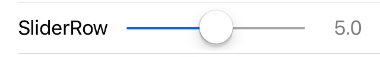

<p align="center">
<a href="https://travis-ci.org/xmartlabs/Eureka"></a>

<a href="https://developer.apple.com/swift"></a>
<a href="https://github.com/Carthage/Carthage"></a>
<a href="https://cocoapods.org/pods/Eureka"></a>
<a href="https://raw.githubusercontent.com/xmartlabs/Eureka/master/LICENSE"></a>
<a href="https://codebeat.co/projects/github-com-xmartlabs-eureka"></a>
</p>

Made with ❤️ by [XMARTLABS](http://xmartlabs.com). This is the re-creation of [XLForm] in Swift.

[简体中文](Documentation/README_CN.md)

## Overview

<table>
  <tr>
    <th>
      
    </th>
    <th>
      
    </th>
    <th>
    
    </th>
  </tr>
</table>

## Contents

* [Requirements]
* [Usage]
  + [How to create a Form]
  + [Getting row values]
  + [Operators]
  + [Using the callbacks]
  + [Section Header and Footer]
  + [Dynamically hide and show rows (or sections)]
  + [List sections]
  + [Multivalued sections]
  + [Validations]
  + [Swipe Actions]
* [Custom rows]
  + [Basic custom rows]
  + [Custom inline rows]
  + [Custom presenter rows]
* [Row catalog]
* [Installation]
* [FAQ]

**For more information look at [our blog post] that introduces *Eureka*.**

## Requirements (for latest release)

* Xcode 11+
* Swift 5.0+

### Example project

You can clone and run the Example project to see examples of most of Eureka's features.

<table>
  <tr>
    <th>
      
    </th>
    <th>
      
    </th>
  </tr>
</table>

## Usage

### How to create a form
By extending `FormViewController` you can then simply add sections and rows to the `form` variable.

```swift
import Eureka

class MyFormViewController: FormViewController {

    override func viewDidLoad() {
        super.viewDidLoad()
        form +++ Section("Section1")
            <<< TextRow(){ row in
                row.title = "Text Row"
                row.placeholder = "Enter text here"
            }
            <<< PhoneRow(){
                $0.title = "Phone Row"
                $0.placeholder = "And numbers here"
            }
        +++ Section("Section2")
            <<< DateRow(){
                $0.title = "Date Row"
                $0.value = Date(timeIntervalSinceReferenceDate: 0)
            }
    }
}
```

In the example we create two sections with standard rows, the result is this:

<center>

</center>

You could create a form by just setting up the `form` property by yourself without extending from `FormViewController` but this method is typically more convenient.

#### Configuring the keyboard navigation accesory

To change the behaviour of this you should set the navigation options of your controller. The `FormViewController` has a `navigationOptions` variable which is an enum and can have one or more of the following values:

- **disabled**: no view at all
- **enabled**: enable view at the bottom
- **stopDisabledRow**: if the navigation should stop when the next row is disabled
- **skipCanNotBecomeFirstResponderRow**: if the navigation should skip the rows that return false to `canBecomeFirstResponder()`

The default value is `enabled & skipCanNotBecomeFirstResponderRow`

To enable smooth scrolling to off-screen rows, enable it via the `animateScroll` property. By default, the `FormViewController` jumps immediately between rows when the user hits the next or previous buttons in the keyboard navigation accesory, including when the next row is off screen.

To set the amount of space between the keyboard and the highlighted row following a navigation event, set the `rowKeyboardSpacing` property. By default, when the form scrolls to an offscreen view no space will be left between the top of the keyboard and the bottom of the row.

```swift
class MyFormViewController: FormViewController {

    override func viewDidLoad() {
        super.viewDidLoad()
        form = ...

	// Enables the navigation accessory and stops navigation when a disabled row is encountered
	navigationOptions = RowNavigationOptions.Enabled.union(.StopDisabledRow)
	// Enables smooth scrolling on navigation to off-screen rows
	animateScroll = true
	// Leaves 20pt of space between the keyboard and the highlighted row after scrolling to an off screen row
	rowKeyboardSpacing = 20
    }
}
```

If you want to change the whole navigation accessory view, you will have to override the `navigationAccessoryView` variable in your subclass of `FormViewController`.


### Getting row values

The `Row` object holds a  ***value*** of a specific type.
For example, a `SwitchRow` holds a `Bool` value, while a `TextRow` holds a `String` value.

```swift
// Get the value of a single row
let row: TextRow? = form.rowBy(tag: "MyRowTag")
let value = row.value

// Get the value of all rows which have a Tag assigned
// The dictionary contains the 'rowTag':value pairs.
let valuesDictionary = form.values()
```

### Operators

Eureka includes custom operators to make form creation easy:

#### +++ &nbsp;&nbsp;&nbsp;&nbsp;&nbsp;&nbsp;Add a section
```swift
form +++ Section()

// Chain it to add multiple Sections
form +++ Section("First Section") +++ Section("Another Section")

// Or use it with rows and get a blank section for free
form +++ TextRow()
     +++ TextRow()  // Each row will be on a separate section
```

#### <<< &nbsp;&nbsp;&nbsp;&nbsp;&nbsp;&nbsp;Insert a row

```swift
form +++ Section()
        <<< TextRow()
        <<< DateRow()

// Or implicitly create the Section
form +++ TextRow()
        <<< DateRow()
```

#### += &nbsp;&nbsp;&nbsp;&nbsp;&nbsp;&nbsp; Append an array

```swift
// Append Sections into a Form
form += [Section("A"), Section("B"), Section("C")]

// Append Rows into a Section
section += [TextRow(), DateRow()]
```

### Using the callbacks

Eureka includes callbacks to change the appearance and behavior of a row.

#### Understanding Row and Cell

A `Row` is an abstraction Eureka uses which holds a **value** and contains the view `Cell`. The `Cell` manages the view and subclasses `UITableViewCell`.

Here is an example:

```swift
let row  = SwitchRow("SwitchRow") { row in      // initializer
                        row.title = "The title"
                    }.onChange { row in
                        row.title = (row.value ?? false) ? "The title expands when on" : "The title"
                        row.updateCell()
                    }.cellSetup { cell, row in
                        cell.backgroundColor = .lightGray
                    }.cellUpdate { cell, row in
                        cell.textLabel?.font = .italicSystemFont(ofSize: 18.0)
                }
```


#### Callbacks list

* **onChange()**

	Called when the value of a row changes. You might be interested in adjusting some parameters here or even make some other rows appear or disappear.

* **onCellSelection()**

	Called each time the user taps on the row and it gets selected.

* **cellSetup()**

	Called only once when the cell is first configured. Set permanent settings here.

* **cellUpdate()**

	Called each time the cell appears on screen. You can change the appearance here using variables that may not be present on cellSetup().

* **onCellHighlightChanged()**

  Called whenever the cell or any subview become or resign the first responder.

* **onRowValidationChanged()**

    Called whenever the the validation errors associated with a row changes.

* **onExpandInlineRow()**

  Called before expanding the inline row. Applies to rows conforming `InlineRowType` protocol.

* **onCollapseInlineRow()**

  Called before collapsing the inline row. Applies to rows conforming `InlineRowType` protocol.

* **onPresent()**

	Called by a row just before presenting another view controller. Applies to rows conforming `PresenterRowType` protocol. Use it to set up the presented controller.


### Section Header and Footer

You can set a title `String` or a custom `View` as the header or footer of a `Section`.

#### String title
```swift
Section("Title")

Section(header: "Title", footer: "Footer Title")

Section(footer: "Footer Title")
```

#### Custom view
You can use a Custom View from a `.xib` file:

```swift
Section() { section in
    var header = HeaderFooterView<MyHeaderNibFile>(.nibFile(name: "MyHeaderNibFile", bundle: nil))

    // Will be called every time the header appears on screen
    header.onSetupView = { view, _ in
        // Commonly used to setup texts inside the view
        // Don't change the view hierarchy or size here!
    }
    section.header = header
}
```

Or a custom `UIView` created programmatically

```swift
Section(){ section in
    var header = HeaderFooterView<MyCustomUIView>(.class)
    header.height = {100}
    header.onSetupView = { view, _ in
        view.backgroundColor = .red
    }
    section.header = header
}
```
Or just build the view with a Callback
```swift
Section(){ section in
    section.header = {
          var header = HeaderFooterView<UIView>(.callback({
              let view = UIView(frame: CGRect(x: 0, y: 0, width: 100, height: 100))
              view.backgroundColor = .red
              return view
          }))
          header.height = { 100 }
          return header
        }()
}
```

### Dynamically hide and show rows (or sections)  <a name="hide-show-rows"></a>


In this case we are hiding and showing whole sections.

To accomplish this each row has a `hidden` variable of optional type `Condition` which can be set using a function or `NSPredicate`.


#### Hiding using a function condition

Using the `function` case of `Condition`:
```swift
Condition.function([String], (Form)->Bool)
```
The array of `String` to pass should contain the tags of the rows this row depends on. Each time the value of any of those rows changes the function is reevaluated.
The function then takes the `Form` and returns a `Bool` indicating whether the row should be hidden or not. This the most powerful way of setting up the `hidden` property as it has no explicit limitations of what can be done.

```swift
form +++ Section()
            <<< SwitchRow("switchRowTag"){
                $0.title = "Show message"
            }
            <<< LabelRow(){

                $0.hidden = Condition.function(["switchRowTag"], { form in
                    return !((form.rowBy(tag: "switchRowTag") as? SwitchRow)?.value ?? false)
                })
                $0.title = "Switch is on!"
        }
```


```swift
public enum Condition {
    case function([String], (Form)->Bool)
    case predicate(NSPredicate)
}
```

#### Hiding using an NSPredicate

The `hidden` variable can also be set with a NSPredicate. In the predicate string you can reference values of other rows by their tags to determine if a row should be hidden or visible.
This will only work if the values of the rows the predicate has to check are NSObjects (String and Int will work as they are bridged to their ObjC counterparts, but enums won't work).
Why could it then be useful to use predicates when they are more limited? Well, they can be much simpler, shorter and readable than functions. Look at this example:

```swift
$0.hidden = Condition.predicate(NSPredicate(format: "$switchTag == false"))
```

And we can write it even shorter since `Condition` conforms to `ExpressibleByStringLiteral`:

```swift
$0.hidden = "$switchTag == false"
```

*Note: we will substitute the value of the row whose tag is 'switchTag' instead of '$switchTag'*

For all of this to work, **all of the implicated rows must have a tag** as the tag will identify them.

We can also hide a row by doing:
```swift
$0.hidden = true
```
as `Condition` conforms to `ExpressibleByBooleanLiteral`.

Not setting the `hidden` variable will leave the row always visible.

##### Sections
For sections this works just the same. That means we can set up section `hidden` property to show/hide it dynamically.

##### Disabling rows
To disable rows, each row has an `disabled` variable which is also an optional `Condition` type property. This variable also works the same as the `hidden` variable so that it requires the rows to have a tag.

Note that if you want to disable a row permanently you can also set `disabled` variable to `true`.

### List Sections

To display a list of options, Eureka includes a special section called `SelectableSection`.
When creating one you need to pass the type of row to use in the options and the `selectionType`.
The `selectionType` is an enum which can be either `multipleSelection` or `singleSelection(enableDeselection: Bool)` where the `enableDeselection` parameter determines if the selected rows can be deselected or not.

```swift
form +++ SelectableSection<ListCheckRow<String>>("Where do you live", selectionType: .singleSelection(enableDeselection: true))

let continents = ["Africa", "Antarctica", "Asia", "Australia", "Europe", "North America", "South America"]
for option in continents {
    form.last! <<< ListCheckRow<String>(option){ listRow in
        listRow.title = option
        listRow.selectableValue = option
        listRow.value = nil
    }
}
```

##### What kind of rows can be used?

To create such a section you have to create a row that conforms the `SelectableRowType` protocol.

```swift
public protocol SelectableRowType : RowType {
    var selectableValue : Value? { get set }
}
```

This `selectableValue` is where the value of the row will be permanently stored. The `value` variable will be used to determine if the row is selected or not, being 'selectableValue' if selected or nil otherwise.
Eureka includes the `ListCheckRow` which is used for example. In the custom rows of the Examples project you can also find the `ImageCheckRow`.

##### Getting the selected rows

To easily get the selected row/s of a `SelectableSection` there are two methods: `selectedRow()` and `selectedRows()` which can be called to get the selected row in case it is a `SingleSelection` section or all the selected rows if it is a `MultipleSelection` section.

##### Grouping options in sections

Additionally you can setup list of options to be grouped by sections using following properties of `SelectorViewController`:

- `sectionKeyForValue` - a closure that should return key for particular row value. This key is later used to break options by sections.

- `sectionHeaderTitleForKey` - a closure that returns header title for a section for particular key. By default returns the key itself.

- `sectionFooterTitleForKey` - a closure that returns footer title for a section for particular key.

### Multivalued Sections

Eureka supports multiple values for a certain field (such as telephone numbers in a contact) by using Multivalued sections. It allows us to easily create insertable, deletable and reorderable sections.


#### How to create a multivalued section

In order to create a multivalued section we have to use `MultivaluedSection` type instead of the regular `Section` type. `MultivaluedSection` extends `Section` and has some additional properties to configure multivalued section behavior.

let's dive into a code example...

```swift
form +++
    MultivaluedSection(multivaluedOptions: [.Reorder, .Insert, .Delete],
                       header: "Multivalued TextField",
                       footer: ".Insert adds a 'Add Item' (Add New Tag) button row as last cell.") {
        $0.addButtonProvider = { section in
            return ButtonRow(){
                $0.title = "Add New Tag"
            }
        }
        $0.multivaluedRowToInsertAt = { index in
            return NameRow() {
                $0.placeholder = "Tag Name"
            }
        }
        $0 <<< NameRow() {
            $0.placeholder = "Tag Name"
        }
    }
```

Previous code snippet shows how to create a multivalued section. In this case we want to insert, delete and reorder rows as multivaluedOptions argument indicates.

`addButtonProvider` allows us to customize the button row which inserts a new row when tapped and `multivaluedOptions` contains `.Insert` value.

`multivaluedRowToInsertAt` closure property is called by Eureka each time a new row needs to be inserted. In order to provide the row to add into multivalued section we should set this property. Eureka passes the index as closure parameter. Notice that we can return any kind of row, even custom rows, even though in most cases multivalued section rows are of the same type.

Eureka automatically adds a button row when we create a insertable multivalued section. We can customize how the this button row looks like as we explained before. `showInsertIconInAddButton` property indicates if plus button (insert style) should appear in the left of the button, true by default.

There are some considerations we need to have in mind when creating insertable sections. Any row added to the insertable multivalued section should be placed above the row that Eureka automatically adds to insert new rows. This can be easily achieved by adding these additional rows to the section from inside the section's initializer closure (last parameter of section initializer) so then Eureka adds the adds insert button at the end of the section.

#### Editing mode

By default Eureka will set the tableView's `isEditing` to true only if there is a MultivaluedSection in the form. This will be done in `viewWillAppear` the first time a form is presented.

For more information on how to use multivalued sections please take a look at Eureka example project which contains several usage examples.

#### Custom add button
If you want to use an add button which is not a `ButtonRow` then you can use `GenericMultivaluedSection<AddButtonType>`, where `AddButtonType` is the type of the row you want to use as add button. This is useful if you want to use a custom row to change the UI of the button.

Example:

```swift
GenericMultivaluedSection<LabelRow>(multivaluedOptions: [.Reorder, .Insert, .Delete], {
    $0.addButtonProvider = { section in
        return LabelRow(){
            $0.title = "A Label row as add button"
        }
    }
    // ...
}
```

### Validations

Eureka 2.0.0 introduces the much requested built-in validations feature.

A row has a collection of `Rules` and a specific configuration that determines when validation rules should be evaluated.

There are some rules provided by default, but you can also create new ones on your own.

The provided rules are:
* RuleRequired
* RuleEmail
* RuleURL
* RuleGreaterThan, RuleGreaterOrEqualThan, RuleSmallerThan, RuleSmallerOrEqualThan
* RuleMinLength, RuleMaxLength
* RuleClosure

Let's see how to set up the validation rules.

```swift

override func viewDidLoad() {
        super.viewDidLoad()
        form
          +++ Section(header: "Required Rule", footer: "Options: Validates on change")

            <<< TextRow() {
                $0.title = "Required Rule"
                $0.add(rule: RuleRequired())

		// This could also have been achieved using a closure that returns nil if valid, or a ValidationError otherwise.
		/*
		let ruleRequiredViaClosure = RuleClosure<String> { rowValue in
		return (rowValue == nil || rowValue!.isEmpty) ? ValidationError(msg: "Field required!") : nil
		}
		$0.add(rule: ruleRequiredViaClosure)
		*/

                $0.validationOptions = .validatesOnChange
            }
            .cellUpdate { cell, row in
                if !row.isValid {
                    cell.titleLabel?.textColor = .systemRed
                }
            }

          +++ Section(header: "Email Rule, Required Rule", footer: "Options: Validates on change after blurred")

            <<< TextRow() {
                $0.title = "Email Rule"
                $0.add(rule: RuleRequired())
                $0.add(rule: RuleEmail())
                $0.validationOptions = .validatesOnChangeAfterBlurred
            }
            .cellUpdate { cell, row in
                if !row.isValid {
                    cell.titleLabel?.textColor = .systemRed
                }
            }

```

As you can see in the previous code snippet we can set up as many rules as we want in a row by invoking row's `add(rule:)` function.

Row also provides  `func remove(ruleWithIdentifier identifier: String)` to remove a rule. In order to use it we must assign an id to the rule after creating it.

Sometimes the collection of rules we want to use on a row is the same we want to use on many other rows. In this case we can set up all validation rules using a `RuleSet` which is a collection of validation rules.

```swift
var rules = RuleSet<String>()
rules.add(rule: RuleRequired())
rules.add(rule: RuleEmail())

let row = TextRow() {
            $0.title = "Email Rule"
            $0.add(ruleSet: rules)
            $0.validationOptions = .validatesOnChangeAfterBlurred
        }
```

Eureka allows us to specify when validation rules should be evaluated. We can do it by setting up `validationOptions` row's property, which can have the following values:


* `.validatesOnChange` - Validates whenever a row value changes.
* `.validatesOnBlur` - (Default value) validates right after the cell resigns first responder. Not applicable for all rows.
* `.validatesOnChangeAfterBlurred` - Validates whenever the row value changes after it resigns first responder for the first time.
* `.validatesOnDemand` - We should manually validate the row or form by invoking `validate()` method.

If you want to validate the entire form (all the rows) you can manually invoke Form `validate()` method.

#### How to get validation errors

Each row has the `validationErrors` property that can be used to retrieve all validation errors. This property just holds the validation error list of the latest row validation execution, which means it doesn't evaluate the validation rules of the row.

#### Note on types

As expected, the Rules must use the same types as the Row object. Be extra careful to check the row type used. You might see a compiler error ("Incorrect arugment label in call (have 'rule:' expected 'ruleSet:')" that is not pointing to the problem when mixing types.

### Swipe Actions

By using swipe actions we can define multiple `leadingSwipe` and `trailingSwipe` actions per row. As swipe actions depend on iOS system features, `leadingSwipe` is available on iOS 11.0+ only.

Let's see how to define swipe actions.

```swift
let row = TextRow() {
            let deleteAction = SwipeAction(
                style: .destructive,
                title: "Delete",
                handler: { (action, row, completionHandler) in
                    //add your code here.
                    //make sure you call the completionHandler once done.
                    completionHandler?(true)
                })
            deleteAction.image = UIImage(named: "icon-trash")

            $0.trailingSwipe.actions = [deleteAction]
            $0.trailingSwipe.performsFirstActionWithFullSwipe = true

            //please be aware: `leadingSwipe` is only available on iOS 11+ only
            let infoAction = SwipeAction(
                style: .normal,
                title: "Info",
                handler: { (action, row, completionHandler) in
                    //add your code here.
                    //make sure you call the completionHandler once done.
                    completionHandler?(true)
                })
            infoAction.actionBackgroundColor = .blue
            infoAction.image = UIImage(named: "icon-info")

            $0.leadingSwipe.actions = [infoAction]
            $0.leadingSwipe.performsFirstActionWithFullSwipe = true
        }
```

Swipe Actions need `tableView.isEditing` be set to `false`. Eureka will set this to `true` if there is a MultivaluedSection in the form (in the `viewWillAppear`).
If you have both MultivaluedSections and swipe actions in the same form you should set `isEditing` according to your needs.

## Custom rows

It is very common that you need a row that is different from those included in Eureka. If this is the case you will have to create your own row but this should not be difficult. You can read [this tutorial on how to create custom rows](https://blog.xmartlabs.com/2016/09/06/Eureka-custom-row-tutorial/) to get started. You might also want to have a look at [EurekaCommunity] which includes some extra rows ready to be added to Eureka.

### Basic custom rows

To create a row with custom behaviour and appearance you'll probably want to create subclasses of `Row` and `Cell`.

Remember that `Row` is the abstraction Eureka uses, while the `Cell` is the actual `UITableViewCell` in charge of the view.
As the `Row` contains the `Cell`, both `Row` and `Cell` must be defined for the same **value** type.

```swift
// Custom Cell with value type: Bool
// The cell is defined using a .xib, so we can set outlets :)
public class CustomCell: Cell<Bool>, CellType {
    @IBOutlet weak var switchControl: UISwitch!
    @IBOutlet weak var label: UILabel!

    public override func setup() {
        super.setup()
        switchControl.addTarget(self, action: #selector(CustomCell.switchValueChanged), for: .valueChanged)
    }

    func switchValueChanged(){
        row.value = switchControl.on
        row.updateCell() // Re-draws the cell which calls 'update' bellow
    }

    public override func update() {
        super.update()
        backgroundColor = (row.value ?? false) ? .white : .black
    }
}

// The custom Row also has the cell: CustomCell and its correspond value
public final class CustomRow: Row<CustomCell>, RowType {
    required public init(tag: String?) {
        super.init(tag: tag)
        // We set the cellProvider to load the .xib corresponding to our cell
        cellProvider = CellProvider<CustomCell>(nibName: "CustomCell")
    }
}
```
The result: <br>


<br>
Custom rows need to subclass `Row<CellType>` and conform to `RowType` protocol.
Custom cells need to subclass `Cell<ValueType>` and conform to `CellType` protocol.

Just like the callbacks cellSetup and CellUpdate, the `Cell` has the setup and update methods where you can customize it.


### Custom inline rows

An inline row is a specific type of row that shows dynamically a row below it, normally an inline row changes between an expanded and collapsed mode whenever the row is tapped.

So to create an inline row we need 2 rows, the row that is "always" visible and the row that will expand/collapse.

Another requirement is that the value type of these 2 rows must be the same. This means if one row holds a `String` value then the other must have a `String` value too.

Once we have these 2 rows, we should make the top row type conform to `InlineRowType`.
This protocol requires you to define an `InlineRow` typealias and a `setupInlineRow` function.
The `InlineRow` type will be the type of the row that will expand/collapse.
Take this as an example:

```swift
class PickerInlineRow<T> : Row<PickerInlineCell<T>> where T: Equatable {

    public typealias InlineRow = PickerRow<T>
    open var options = [T]()

    required public init(tag: String?) {
        super.init(tag: tag)
    }

    public func setupInlineRow(_ inlineRow: InlineRow) {
        inlineRow.options = self.options
        inlineRow.displayValueFor = self.displayValueFor
        inlineRow.cell.height = { UITableViewAutomaticDimension }
    }
}
```

The `InlineRowType` will also add some methods to your inline row:

```swift
func expandInlineRow()
func collapseInlineRow()
func toggleInlineRow()
```

These methods should work fine but should you want to override them keep in mind that it is `toggleInlineRow` that has to call `expandInlineRow` and `collapseInlineRow`.

Finally you must invoke `toggleInlineRow()` when the row is selected, for example overriding `customDidSelect`:

```swift
public override func customDidSelect() {
    super.customDidSelect()
    if !isDisabled {
        toggleInlineRow()
    }
}
```

### Custom Presenter rows

**Note:** *A Presenter row is a row that presents a new UIViewController.*

To create a custom Presenter row you must create a class that conforms the `PresenterRowType` protocol. It is highly recommended to subclass `SelectorRow` as it does conform to that protocol and adds other useful functionality.

The PresenterRowType protocol is defined as follows:
```swift
public protocol PresenterRowType: TypedRowType {

     associatedtype PresentedControllerType : UIViewController, TypedRowControllerType

     /// Defines how the view controller will be presented, pushed, etc.
     var presentationMode: PresentationMode<PresentedControllerType>? { get set }

     /// Will be called before the presentation occurs.
     var onPresentCallback: ((FormViewController, PresentedControllerType) -> Void)? { get set }
}
```

The onPresentCallback will be called when the row is about to present another view controller. This is done in the `SelectorRow` so if you do not subclass it you will have to call it yourself.

The `presentationMode` is what defines how the controller is presented and which controller is presented. This presentation can be using a Segue identifier, a segue class, presenting a controller modally or pushing to a specific view controller. For example a CustomPushRow can be defined like this:


Let's see an example..

```swift

/// Generic row type where a user must select a value among several options.
open class SelectorRow<Cell: CellType>: OptionsRow<Cell>, PresenterRowType where Cell: BaseCell {


    /// Defines how the view controller will be presented, pushed, etc.
    open var presentationMode: PresentationMode<SelectorViewController<SelectorRow<Cell>>>?

    /// Will be called before the presentation occurs.
    open var onPresentCallback: ((FormViewController, SelectorViewController<SelectorRow<Cell>>) -> Void)?

    required public init(tag: String?) {
        super.init(tag: tag)
    }

    /**
     Extends `didSelect` method
     */
    open override func customDidSelect() {
        super.customDidSelect()
        guard let presentationMode = presentationMode, !isDisabled else { return }
        if let controller = presentationMode.makeController() {
            controller.row = self
            controller.title = selectorTitle ?? controller.title
            onPresentCallback?(cell.formViewController()!, controller)
            presentationMode.present(controller, row: self, presentingController: self.cell.formViewController()!)
        } else {
            presentationMode.present(nil, row: self, presentingController: self.cell.formViewController()!)
        }
    }

    /**
     Prepares the pushed row setting its title and completion callback.
     */
    open override func prepare(for segue: UIStoryboardSegue) {
        super.prepare(for: segue)
        guard let rowVC = segue.destination as Any as? SelectorViewController<SelectorRow<Cell>> else { return }
        rowVC.title = selectorTitle ?? rowVC.title
        rowVC.onDismissCallback = presentationMode?.onDismissCallback ?? rowVC.onDismissCallback
        onPresentCallback?(cell.formViewController()!, rowVC)
        rowVC.row = self
    }
}


// SelectorRow conforms to PresenterRowType
public final class CustomPushRow<T: Equatable>: SelectorRow<PushSelectorCell<T>>, RowType {

    public required init(tag: String?) {
        super.init(tag: tag)
        presentationMode = .show(controllerProvider: ControllerProvider.callback {
            return SelectorViewController<T>(){ _ in }
            }, onDismiss: { vc in
                _ = vc.navigationController?.popViewController(animated: true)
        })
    }
}
```


### Subclassing cells using the same row

Sometimes we want to change the UI look of one of our rows but without changing the row type and all the logic associated to one row.
There is currently one way to do this **if you are using cells that are instantiated from nib files**. Currently, none of Eureka's core rows are instantiated from nib files but some of the custom rows in [EurekaCommunity] are, in particular the [PostalAddressRow](https://github.com/EurekaCommunity/PostalAddressRow) which was moved there.

What you have to do is:
* Create a nib file containing the cell you want to create.
* Then set the class of the cell to be the existing cell you want to modify (if you want to change something more apart from pure UI then you should subclass that cell). Make sure the module of that class is correctly set
* Connect the outlets to your class
* Tell your row to use the new nib file. This is done by setting the `cellProvider` variable to use this nib. You should do this in the initialiser, either in each concrete instantiation or using the `defaultRowInitializer`. For example:

```swift
<<< PostalAddressRow() {
     $0.cellProvider = CellProvider<PostalAddressCell>(nibName: "CustomNib", bundle: Bundle.main)
}
```

You could also create a new row for this. In that case try to inherit from the same superclass as the row you want to change to inherit its logic.

There are some things to consider when you do this:
* If you want to see an example have a look at the [PostalAddressRow](https://github.com/EurekaCommunity/PostalAddressRow) or the [CreditCardRow](https://github.com/EurekaCommunity/CreditCardRow) which have use a custom nib file in their examples.
* If you get an error saying `Unknown class <YOUR_CLASS_NAME> in Interface Builder file`, it might be that you have to instantiate that new type somewhere in your code to load it in the runtime. Calling `let t = YourClass.self` helped in my case.


## Row catalog

### Controls Rows
<table>
    <tr>
        <td><center><b>Label Row</b><br>
        
        </center><br><br>
        </td>
        <td><center><b>Button Row</b><br>
        
        </center><br><br>
        </td>
        <td><center><b>Check Row</b><br>
        
        </center><br><br>
        </td>
    </tr>
    <tr>
        <td><center><b>Switch Row</b><br>
        
        </center><br><br>
        </td>
        <td><center><b>Slider Row</b><br>
        
        </center><br><br>
        </td>
        <td><center><b>Stepper Row</b><br>
        
        </center><br><br>
        </td>
    </tr>
    <tr>
        <td><center><b>Text Area Row</b><br>
        
        </center><br><br>
        </td>
    </tr>
</table>

### Field Rows
These rows have a textfield on the right side of the cell. The difference between each one of them consists in a different capitalization, autocorrection and keyboard type configuration.

<table>
<tr>
  <td>
    
  </td>
  <td>
  TextRow<br><br>
  NameRow<br><br>
  URLRow<br><br>
  IntRow<br><br>
  PhoneRow<br><br>
  PasswordRow<br><br>
  EmailRow<br><br>
  DecimalRow<br><br>
  TwitterRow<br><br>
  AccountRow<br><br>
  ZipCodeRow
  </td>
<tr>
</table>

All of the `FieldRow` subtypes above have a `formatter` property of type <a href="https://developer.apple.com/library/mac/documentation/Cocoa/Reference/Foundation/Classes/NSFormatter_Class/">`NSFormatter`</a> which can be set to determine how that row's value should be displayed. A custom formatter for numbers with two digits after the decimal mark is included with Eureka (`DecimalFormatter`). The Example project also contains a `CurrencyFormatter` which displays a number as currency according to the user's locale.

By default, setting a row's `formatter` only affects how a value is displayed when it is not being edited. To also format the value while the row is being edited, set `useFormatterDuringInput` to `true` when initializing the row. Formatting the value as it is being edited may require updating the cursor position and Eureka provides the following protocol that your formatter should conform to in order to handle cursor position:

```swift
public protocol FormatterProtocol {
    func getNewPosition(forPosition forPosition: UITextPosition, inTextInput textInput: UITextInput, oldValue: String?, newValue: String?) -> UITextPosition
}
```

Additionally, `FieldRow` subtypes have a `useFormatterOnDidBeginEditing` property. When using a `DecimalRow` with a formatter that allows decimal values and conforms to the user's locale (e.g. `DecimalFormatter`), if `useFormatterDuringInput` is `false`, `useFormatterOnDidBeginEditing` must be set to `true` so that the decimal mark in the value being edited matches the decimal mark on the keyboard.

### Date Rows

Date Rows hold a Date and allow us to set up a new value through UIDatePicker control. The mode of the UIDatePicker and the way how the date picker view is shown is what changes between them.
<table>
<tr>
<td>
<center><b>Date Row</b>

<br>
Picker shown in the keyboard.
</center>
</td>
<td>
<center><b>Date Row (Inline)</b>

<br>
The row expands.
</center>
</td>
<td>
<center><b>Date Row (Picker)</b>

<br>
The picker is always visible.
</center>
</td>
</tr>
</table>

With those 3 styles (Normal, Inline & Picker), Eureka includes:

+ **DateRow**
+ **TimeRow**
+ **DateTimeRow**
+ **CountDownRow**

### Option Rows
These are rows with a list of options associated from which the user must choose.

```swift
<<< ActionSheetRow<String>() {
                $0.title = "ActionSheetRow"
                $0.selectorTitle = "Pick a number"
                $0.options = ["One","Two","Three"]
                $0.value = "Two"    // initially selected
            }
```

<table>
<tr>
<td width="25%">
<center><b>Alert Row</b><br>

<br>
Will show an alert with the options to choose from.
</center>
</td>
<td width="25%">
<center><b>ActionSheet Row</b><br>

<br>
Will show an action sheet with the options to choose from.
</center>
</td>
<td width="25%">
<center><b>Push Row</b><br>

<br>
Will push to a new controller from where to choose options listed using Check rows.
</center>
</td>
<td width="25%">
<center><b>Multiple Selector Row</b><br>

<br>
Like PushRow but allows the selection of multiple options.
</center>
</td>
</tr>
</table>

<table>
    <tr>
        <td><center><b>Segmented Row</b><br>
        
        </center>
        </td>
        <td><center><b>Segmented Row (w/Title)</b><br>
        
        </center>
        </td>
        <td><center><b>Picker Row</b><br>
        
        <br>Presents options of a generic type through a picker view
        <br><b>(There is also Picker Inline Row)</b>
        </center>
        </td>
    </tr>
</table>

### Built your own custom row?
Let us know about it, we would be glad to mention it here. :)

* **LocationRow** (Included as custom row in the example project)


## Installation

#### CocoaPods

[CocoaPods](https://cocoapods.org/) is a dependency manager for Cocoa projects.

Specify Eureka into your project's `Podfile`:

```ruby
source 'https://github.com/CocoaPods/Specs.git'
platform :ios, '9.0'
use_frameworks!

pod 'Eureka'
```

Then run the following command:

```bash
$ pod install
```

#### Swift Package Manager

[Swift Package Manager](https://swift.org/package-manager/) is a tool for managing the distribution of Swift code.

After you set up your `Package.swift` manifest file, you can add Eureka as a dependency by adding it to the dependencies value of your `Package.swift`.

dependencies: [
    .package(url: "https://github.com/xmartlabs/Eureka.git", from: "5.3.4")
]


#### Carthage

[Carthage](https://github.com/Carthage/Carthage) is a simple, decentralized dependency manager for Cocoa.

Specify Eureka into your project's `Cartfile`:

```ogdl
github "xmartlabs/Eureka" ~> 5.3
```

#### Manually as Embedded Framework

* Clone Eureka as a git [submodule](http://git-scm.com/docs/git-submodule) by running the following command from your project root git folder.

```bash
$ git submodule add https://github.com/xmartlabs/Eureka.git
```

* Open Eureka folder that was created by the previous git submodule command and drag the Eureka.xcodeproj into the Project Navigator of your application's Xcode project.

* Select the Eureka.xcodeproj in the Project Navigator and verify the deployment target matches with your application deployment target.

* Select your project in the Xcode Navigation and then select your application target from the sidebar. Next select the "General" tab and click on the + button under the "Embedded Binaries" section.

* Select `Eureka.framework` and we are done!

## Getting involved

* If you **want to contribute** please feel free to **submit pull requests**.
* If you **have a feature request** please **open an issue**.
* If you **found a bug** check older issues before submitting an issue.
* If you **need help** or would like to **ask general question**, use [StackOverflow]. (Tag `eureka-forms`).

**Before contribute check the [CONTRIBUTING](CONTRIBUTING.md) file for more info.**

If you use **Eureka** in your app We would love to hear about it! Drop us a line on [twitter].

## Authors

* [Martin Barreto](https://github.com/mtnBarreto) ([@mtnBarreto](https://twitter.com/mtnBarreto))
* [Mathias Claassen](https://github.com/mats-claassen) ([@mClaassen26](https://twitter.com/mClaassen26))

## FAQ

#### How to change the text representation of the row value shown in the  cell.

Every row has the following property:

```swift
/// Block variable used to get the String that should be displayed for the value of this row.
public var displayValueFor: ((T?) -> String?)? = {
    return $0.map { String(describing: $0) }
}
```

You can set `displayValueFor` according the string value you want to display.

#### How to get a Row using its tag value

We can get a particular row by invoking any of the following functions exposed by the `Form` class:

```swift
public func rowBy<T: Equatable>(tag: String) -> RowOf<T>?
public func rowBy<Row: RowType>(tag: String) -> Row?
public func rowBy(tag: String) -> BaseRow?
```

For instance:

```swift
let dateRow : DateRow? = form.rowBy(tag: "dateRowTag")
let labelRow: LabelRow? = form.rowBy(tag: "labelRowTag")

let dateRow2: Row<DateCell>? = form.rowBy(tag: "dateRowTag")

let labelRow2: BaseRow? = form.rowBy(tag: "labelRowTag")
```

#### How to get a Section using its tag value

```swift
let section: Section?  = form.sectionBy(tag: "sectionTag")
```

#### How to set the form values using a dictionary

Invoking `setValues(values: [String: Any?])` which is exposed by `Form` class.

For example:

```swift
form.setValues(["IntRowTag": 8, "TextRowTag": "Hello world!", "PushRowTag": Company(name:"Xmartlabs")])
```

Where `"IntRowTag"`, `"TextRowTag"`, `"PushRowTag"` are row tags (each one uniquely identifies a row) and `8`, `"Hello world!"`, `Company(name:"Xmartlabs")` are the corresponding row value to assign.

The value type of a row must match with the value type of the corresponding dictionary value otherwise nil will be assigned.

If the form was already displayed we have to reload the visible rows either by reloading the table view `tableView.reloadData()` or invoking `updateCell()` to each visible row.

#### Row does not update after changing hidden or disabled condition

After setting a condition, this condition is not automatically evaluated. If you want it to do so immediately you can call `.evaluateHidden()` or `.evaluateDisabled()`.

This functions are just called when a row is added to the form and when a row it depends on changes. If the condition is changed when the row is being displayed then it must be reevaluated manually.

#### onCellUnHighlight doesn't get called unless onCellHighlight is also defined

Look at this [issue](https://github.com/xmartlabs/Eureka/issues/96).

#### How to update a Section header/footer

* Set up a new header/footer data ....

```swift
section.header = HeaderFooterView(title: "Header title \(variable)") // use String interpolation
//or
var header = HeaderFooterView<UIView>(.class) // most flexible way to set up a header using any view type
header.height = { 60 }  // height can be calculated
header.onSetupView = { view, section in  // each time the view is about to be displayed onSetupView is invoked.
    view.backgroundColor = .orange
}
section.header = header
```

* Reload the Section to perform the changes

```swift
section.reload()
```

#### How to customize Selector and MultipleSelector option cells

`selectableRowSetup`, `selectableRowCellUpdate` and `selectableRowCellSetup` properties are provided to be able to customize SelectorViewController and MultipleSelectorViewController selectable cells.

```swift
let row = PushRow<Emoji>() {
              $0.title = "PushRow"
              $0.options = [💁🏻, 🍐, 👦🏼, 🐗, 🐼, 🐻]
              $0.value = 👦🏼
              $0.selectorTitle = "Choose an Emoji!"
          }.onPresent { from, to in
              to.dismissOnSelection = false
              to.dismissOnChange = false
              to.selectableRowSetup = { row in
                  row.cellProvider = CellProvider<ListCheckCell<Emoji>>(nibName: "EmojiCell", bundle: Bundle.main)
              }
              to.selectableRowCellUpdate = { cell, row in
                  cell.textLabel?.text = "Text " + row.selectableValue!  // customization
                  cell.detailTextLabel?.text = "Detail " +  row.selectableValue!
              }
          }

```

#### Don't want to use Eureka custom operators?

As we've said `Form` and `Section` types conform to `MutableCollection` and `RangeReplaceableCollection`. A Form is a collection of Sections and a Section is a collection of Rows.

`RangeReplaceableCollection` protocol extension provides many useful methods to modify collection.

```swift
extension RangeReplaceableCollection {
    public mutating func append(_ newElement: Self.Element)
    public mutating func append<S>(contentsOf newElements: S) where S : Sequence, Self.Element == S.Element
    public mutating func insert(_ newElement: Self.Element, at i: Self.Index)
    public mutating func insert<S>(contentsOf newElements: S, at i: Self.Index) where S : Collection, Self.Element == S.Element
    public mutating func remove(at i: Self.Index) -> Self.Element
    public mutating func removeSubrange(_ bounds: Range<Self.Index>)
    public mutating func removeFirst(_ n: Int)
    public mutating func removeFirst() -> Self.Element
    public mutating func removeAll(keepingCapacity keepCapacity: Bool)
    public mutating func reserveCapacity(_ n: Self.IndexDistance)
}
```

These methods are used internally to implement the custom operators as shown bellow:

```swift
public func +++(left: Form, right: Section) -> Form {
    left.append(right)
    return left
}

public func +=<C : Collection>(inout lhs: Form, rhs: C) where C.Element == Section {
    lhs.append(contentsOf: rhs)
}

public func <<<(left: Section, right: BaseRow) -> Section {
    left.append(right)
    return left
}

public func +=<C : Collection>(inout lhs: Section, rhs: C) where C.Element == BaseRow {
    lhs.append(contentsOf: rhs)
}
```

You can see how the rest of custom operators are implemented [here](https://github.com/xmartlabs/Eureka/blob/master/Source/Core/Operators.swift).

It's up to you to decide if you want to use Eureka custom operators or not.

#### How to set up your form from a storyboard
The form is always displayed in a `UITableView`. You can set up your view controller in a storyboard and add a UITableView where you want it to be and then connect the outlet to FormViewController's `tableView` variable. This allows you to define a custom frame (possibly with constraints) for your form.

All of this can also be done by programmatically changing frame, margins, etc. of the `tableView` of your FormViewController.


<!--- In file -->
[Introduction]: #introduction
[Requirements]: #requirements

[How to create a Form]: #how-to-create-a-form
[Getting row values]: #getting-row-values
[How to get the form values]: #how-to-get-the-form-values
[Examples]: #examples
[Usage]: #usage
[Operators]: #operators
[Rows]: #rows
[Using the callbacks]: #using-the-callbacks
[Section Header and Footer]: #section-header-and-footer
[Custom rows]: #custom-rows
[Basic custom rows]: #basic-custom-rows
[Custom inline rows]: #custom-inline-rows
[Custom presenter rows]: #custom-presenter-rows
[How to create custom inline rows]: #how-to-create-custom-inline-rows
[Custom rows catalog]: #custom-rows-catalog
[Dynamically hide and show rows (or sections)]: #hide-show-rows
[Implementing a custom Presenter row]: #custom-presenter-row
[Extensibility]: #extensibility
[Row catalog]: #row-catalog
[Installation]: #installation
[FAQ]: #faq

[List sections]: #list-sections
[Multivalued sections]: #multivalued-sections
[Validations]: #validations
[Swipe Actions]: #swipe-actions

<!--- In Project -->
[CustomCellsController]: Example/Example/ViewController.swift
[FormViewController]: Example/Source/Controllers.swift

<!--- External -->
[XLForm]: https://github.com/xmartlabs/XLForm
[DSL]: https://en.wikipedia.org/wiki/Domain-specific_language
[StackOverflow]: http://stackoverflow.com/questions/tagged/eureka-forms
[our blog post]: http://blog.xmartlabs.com/2015/09/29/Introducing-Eureka-iOS-form-library-written-in-pure-Swift/
[twitter]: https://twitter.com/xmartlabs
[EurekaCommunity]: https://github.com/EurekaCommunity

# Donate to Eureka

So we can make Eureka even better!<br><br>
[](https://www.paypal.com/cgi-bin/webscr?cmd=_s-xclick&hosted_button_id=HRMAH7WZ4QQ8E)

# Change Log

This can be found in the [CHANGELOG.md](CHANGELOG.md) file.
